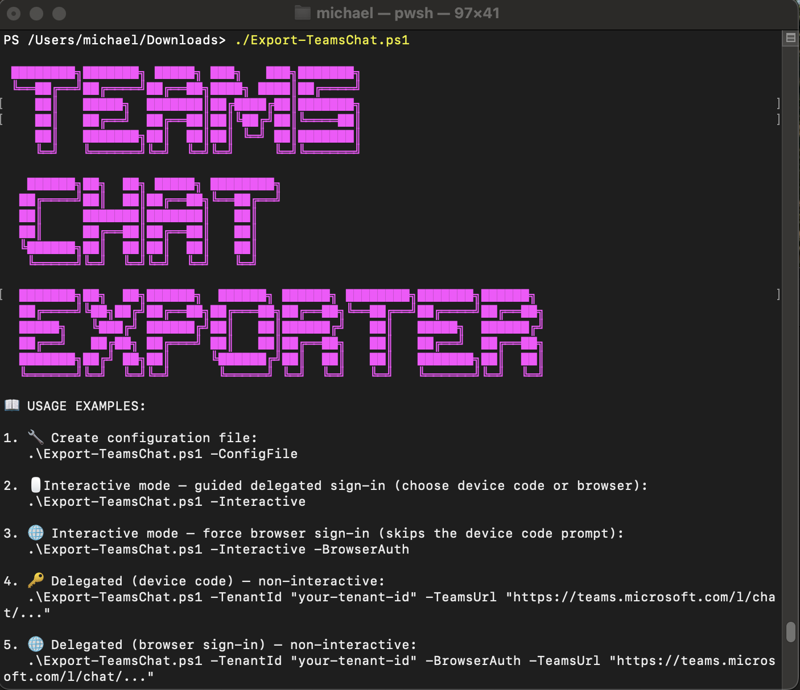

# Export-TeamsChat.ps1

[](LICENSE)
[](https://github.com/mardahl/Export-TeamsChat/commits/main)
[](https://github.com/mardahl/Export-TeamsChat)
[](https://learn.microsoft.com/powershell/)
[](https://learn.microsoft.com/graph/)

Export Microsoft Teams chat conversations to `TXT`, `JSON`, `HTML`, or `CSV` using the Microsoft Graph API.

The script supports both personal exports with delegated sign-in and tenant-wide exports with app-only credentials. It accepts normal Teams deep links, pulls the full chat history with pagination, and can localize hosted inline images so exports remain useful offline.



## Current capabilities

- Export a Teams chat from a normal Teams chat or message link
- Output formats: `TXT`, `JSON`, `HTML`, `CSV`
- Export chat metadata, participants, and full message history
- Handle paginated Graph results for larger chats
- Support delegated authentication with:
  - device code flow
  - browser sign-in with PKCE via `-BrowserAuth`
- Support app-only authentication with client credentials
- Guided interactive mode via `-Interactive`
- Non-interactive runs via parameters
- Config template generation via `-ConfigFile`
- Reuse saved defaults from `TeamsExportConfig.json`
- Download hosted inline images into a sibling `-assets` folder and rewrite references to local paths
- Return the exported file path on stdout so the script can be used in pipelines or automation
- Run on PowerShell 5.1 and PowerShell 7+

## What it is good for

- Personal chat exports
- Offline chat archives
- Human-readable transcripts for internal review
- Feeding chat data into analysis, search, RAG, or LLM workflows
- Admin-driven tenant exports where app permissions are appropriate

## Authentication modes

| Mode | Best for | Permissions | Admin consent | Scope |
|---|---|---|---|---|
| Delegated | Personal use, one-off exports | `Chat.Read` | Usually no | Chats the signed-in user can access |
| App-only | Admin and automation scenarios | `Chat.Read.All` | Yes | Chats across the tenant |

### Delegated sign-in flows

| Flow | Switch | Use when |
|---|---|---|
| Device code | default | Standard delegated sign-in |
| Browser sign-in with PKCE | `-BrowserAuth` | Device code is blocked by Conditional Access or tenant policy |

`-BrowserAuth` starts a temporary loopback listener on `http://localhost:<port>` using an available port from `8400` to `8420`.

## Requirements

### Delegated mode

- PowerShell 5.1 or newer
- A Microsoft Entra tenant ID is recommended, but optional
- A client ID with delegated `Chat.Read`, or use the default Microsoft Graph Command Line Tools app ID: `14d82eec-204b-4c2f-b7e8-296a70dab67e`
- For `-BrowserAuth`, your app must allow a loopback redirect URI such as `http://localhost:8400`

### App-only mode

- PowerShell 5.1 or newer
- A Microsoft Entra app registration with:
  - `Chat.Read.All` application permission
  - `ChatMessage.Read.All` application permission is optional
  - admin consent granted
  - a client secret

## Quick start

### Interactive delegated export

```powershell
pwsh ./Export-TeamsChat.ps1 -Interactive
```

The guided mode will let you:

- enter or reuse `TenantId`
- enter or reuse `ClientId`
- choose device code or browser sign-in
- paste a Teams chat URL
- choose output format and location
- confirm the final export settings before running

### Interactive delegated export with browser sign-in

```powershell
pwsh ./Export-TeamsChat.ps1 -Interactive -BrowserAuth
```

### Non-interactive delegated export

Device code:

```powershell
pwsh ./Export-TeamsChat.ps1 -TenantId "<tenantId>" -ClientId "<clientId>" -TeamsUrl "https://teams.microsoft.com/l/chat/..."
```

Browser sign-in:

```powershell
pwsh ./Export-TeamsChat.ps1 -TenantId "<tenantId>" -ClientId "<clientId>" -Delegated -BrowserAuth -TeamsUrl "https://teams.microsoft.com/l/chat/..."
```

### App-only export

```powershell
pwsh ./Export-TeamsChat.ps1 -TenantId "<tenantId>" -ClientId "<clientId>" -ClientSecret "<secret>" -TeamsUrl "https://teams.microsoft.com/l/chat/..."
```

## Configuration file

Create a template config file next to the script:

```powershell
pwsh ./Export-TeamsChat.ps1 -ConfigFile
```

This creates `TeamsExportConfig.json` with placeholders and setup guidance.

Supported fields:

| Field | Description |
|---|---|
| `AuthMode` | `Delegated` or `AppOnly` |
| `TenantId` | Entra tenant ID |
| `ClientId` | App registration client ID |
| `ClientSecret` | App secret for app-only mode |

The script can also use config values as defaults in interactive mode.

Do not commit `TeamsExportConfig.json` to source control.

## Usage examples

Use the default delegated app ID in guided mode:

```powershell
pwsh ./Export-TeamsChat.ps1 -Interactive
```

Generate an HTML export:

```powershell
pwsh ./Export-TeamsChat.ps1 -TeamsUrl "https://teams.microsoft.com/l/chat/..." -ExportFormat HTML
```

Export to a custom folder:

```powershell
pwsh ./Export-TeamsChat.ps1 -TeamsUrl "https://teams.microsoft.com/l/chat/..." -ExportFormat JSON -OutputPath "./exports"
```

Use config-backed credentials:

```powershell
pwsh ./Export-TeamsChat.ps1 -TeamsUrl "https://teams.microsoft.com/l/chat/..."
```

## Output details

| Format | What you get |
|---|---|
| `TXT` | Plain text transcript with chat metadata and localized asset references |
| `JSON` | Structured export with chat info, full message objects, totals, and export timestamp |
| `HTML` | Styled transcript suitable for reading in a browser, with local asset links when available |
| `CSV` | Flat message export with timestamp, sender, message type, content, and message ID |

Additional output behavior:

- The script writes the exported file to disk
- The full export path is also written to stdout
- Hosted inline images are downloaded into a sibling folder named like `teams-chat-export-2026-04-24-1530-assets`
- HTML and JSON exports use rewritten local references for downloaded hosted content
- TXT and CSV exports include localized asset references in the message content
- File attachments are not downloaded
- Failed asset downloads log a warning and do not stop the export

## Teams links the script understands

- Chat links copied from the Teams sidebar
- Chat links copied from the chat header
- Individual message links copied from a chat

The script extracts the underlying chat ID from common Teams deep-link patterns such as `19:...@thread.v2` and `...@unq`.

## Notes and limitations

- Microsoft Graph base URL: `https://graph.microsoft.com/v1.0`
- Delegated mode can only access chats available to the signed-in user
- App-only mode requires tenant admin approval for the app permissions
- Browser sign-in depends on a loopback redirect URI and an open local port in the `8400-8420` range
- This is not an eDiscovery or evidentiary preservation tool
- Export files are ordinary files and can be modified after creation

For tamper-evident or compliance-focused workflows, use Microsoft 365 Purview eDiscovery or add your own hashing, signing, and controlled storage process.

## License

- Prosperity Public License 3.0.0
- See `LICENSE` or https://prosperitylicense.com/versions/3.0.0
- For commercial licensing, contact the author

## Author

Michael Mardahl

- GitHub: https://github.com/mardahl
- Repo: https://github.com/mardahl/Export-TeamsChat

## Support

Issues and contributions are welcome on GitHub.
